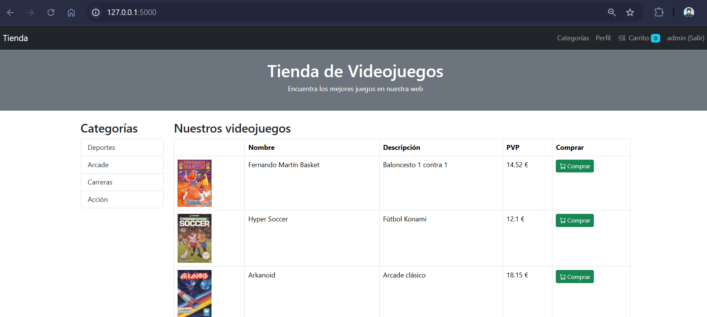
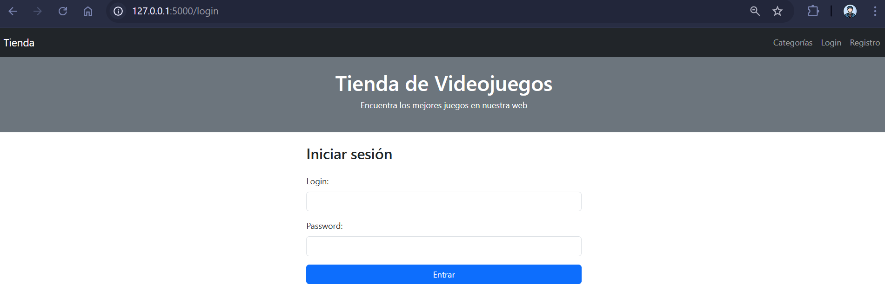
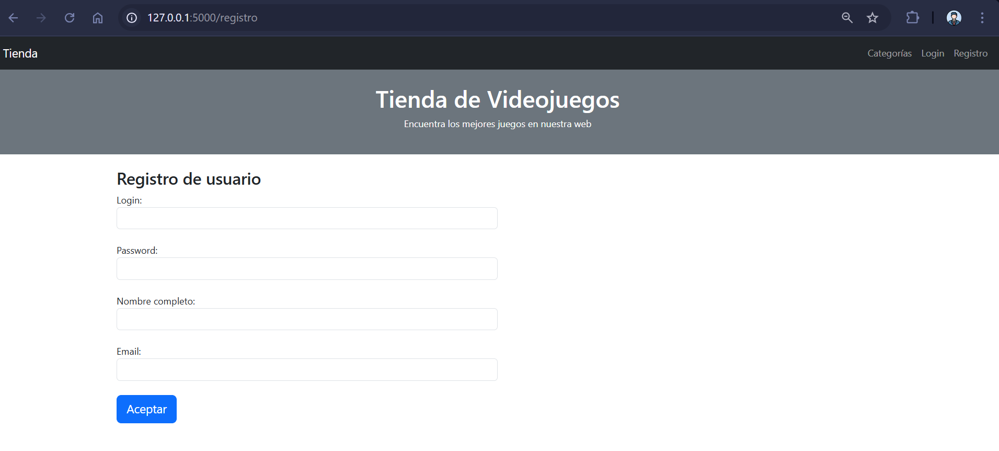
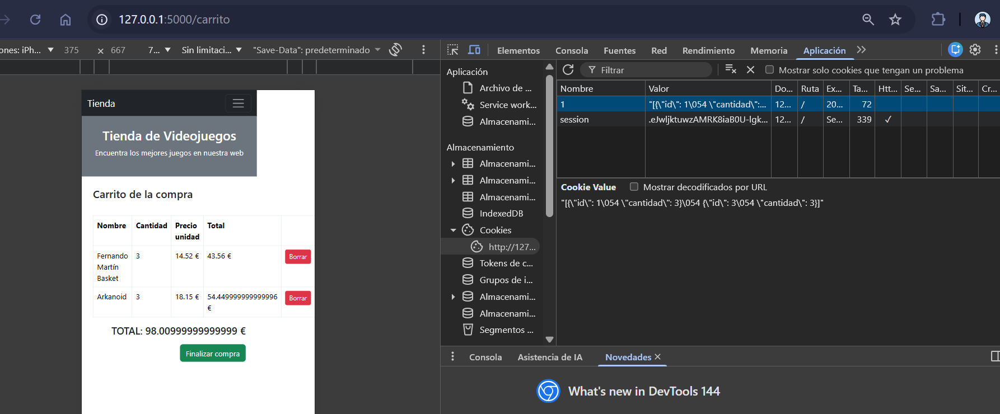

# 🎮 Proyecto Tienda de Videojuegos – Flask + SQLAlchemy

📚 **Asignatura:** Desarrollo Web / Backend

🧠 **Tecnologías:** Python · Flask · SQLAlchemy · Flask-Login · Jinja2 · SQLite

🛠 **Entorno:** WSL · VS Code

👤 **Autor:** Alberto Jiménez Rodríguez

📅 **Estado:** ✅ Aplicación completa con proceso de compra funcional

---

## 📸 CAPTURAS DEL PROYECTO

### 🏠 Vista principal



### 🔐 Login



### 🔐 Registro



### 🛒 Carrito



---

## 🧠 Objetivo del proyecto

Desarrollar una **aplicación web completa con Flask** simulando una tienda online que implemente:

- Gestión de usuarios
- Control de permisos
- Persistencia de datos
- Gestión de estado (sesión + cookies)
- Proceso real de compra
- Renderizado dinámico con plantillas

---

## 🖥️ Entorno de desarrollo

### 🐧 WSL (Windows Subsystem for Linux)

El proyecto se ha desarrollado íntegramente en **WSL**, permitiendo trabajar en un entorno Linux real.

📌 Ruta del proyecto:

```bash
/home/usuario/Proyectos/ProyectoFlaskSQL
```

---

## ⚙️ Preparación del entorno

### 1️⃣ Crear entorno virtual

```bash
python3 -m venv venvsource venv/bin/activate
```

### 2️⃣ Instalar dependencias

```bash
pip install -r requirements.txt
```

### 3️⃣ Inicializar base de datos

```bash
flask --app manage.py drop_tables
flask --app manage.py create_tables
flask --app manage.py add_data_tables
flask --app manage.py create_admin
```

### 4️⃣ Ejecutar aplicación

```bash
flask --app manage.py run --debug
```

📍 URL:

```
http://127.0.0.1:5000
```

---

## 🗂️ Estructura del proyecto

```
ProyectoFlaskSQL/
│
├── aplicacion/
│   ├── app.py
│   ├── models.py
│   ├── forms.py
│   ├── config.py
│   ├── dbase.db
│   │
│   ├──static/
│   │   ├── img/
│   │   └── capturas/
│   │
│   └── templates/
│       ├── base.html
│       ├── base2.html
│       ├── inicio.html
│       ├── carrito.html
│       ├── carrito_add.html
│       ├── pedido.html
│       └── login / usuarios / categorias / articulos
│
├── manage.py
├── requirements.txt
└── README.md
```

---

## 🧱 Modelo de datos (ORM)

### Entidades

- 👤 Usuario
- 🏷 Categoria
- 🎮 Articulo

### Relaciones

- Una categoría tiene muchos artículos
- El carrito pertenece a un usuario (cookie por id)

---

## 🔐 Autenticación y permisos

Implementado con **Flask-Login**

- Login / Logout
- Protección de rutas
- Roles admin / usuario
- Redirecciones seguras
- Hash de contraseñas

---

## 🧾 Formularios

- Registro
- Login
- Crear artículos
- Crear categorías
- Añadir al carrito
- Cambio de contraseña

✔ Validaciones

✔ CSRF

✔ Mensajes de error

---

## 🛒 Sistema de compra completo

El carrito se almacena en una **cookie JSON por usuario**

```json
[{"id":1,"cantidad":2},{"id":4,"cantidad":1}]
```

### Funcionalidades

✔ Añadir productos

✔ Ver carrito

✔ Eliminar producto del carrito

✔ Calcular total automáticamente

✔ Finalizar compra

✔ Descontar stock en base de datos

✔ Vaciar carrito automáticamente

✔ Confirmación de pedido

---

## 📦 Flujo de compra

1. Usuario añade producto
2. Se guarda en cookie
3. Usuario entra al carrito
4. Puede eliminar artículos
5. Finaliza compra
6. Se descuenta stock en BD
7. Se borra cookie
8. Se muestra confirmación

---

## 🧠 Plantillas (Jinja2)

Uso completo de:

- Herencia
- Condicionales
- Bucles
- Variables
- Control por permisos
- Componentes reutilizables

---

## ⚠️ Gestión de errores

- `abort(404)`
- `get_or_404`
- Página personalizada
- Control de acceso

---

## 🏁 Funcionalidades implementadas

✔ Rutas estáticas

✔ Rutas dinámicas

✔ GET / POST

✔ Formularios

✔ Subida de archivos

✔ ORM

✔ Login / Logout

✔ Permisos

✔ Sesiones

✔ Cookies

✔ Carrito persistente

✔ Compra real con actualización de stock

---

## 🧾 Conclusión

Este proyecto implementa una **aplicación web completa tipo e-commerce básico**, integrando:

- Backend real
- Seguridad
- Persistencia
- Estado del usuario
- Flujo de compra funcional

Simula el comportamiento de una tienda online real con gestión de inventario.